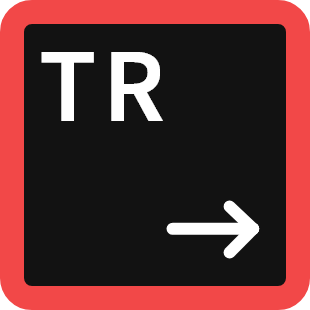

<!-- PROJECT SHIELDS -->
<!--
*** I'm using markdown "reference style" links for readability.
*** Reference links are enclosed in brackets [ ] instead of parentheses ( ).
*** See the bottom of this document for the declaration of the reference variables
*** for contributors-url, forks-url, etc. This is an optional, concise syntax you may use.
*** https://www.markdownguide.org/basic-syntax/#reference-style-links
-->
[![Contributors][contributors-shield]][contributors-url]
[![Forks][forks-shield]][forks-url]
[![Stargazers][stars-shield]][stars-url]
[![Issues][issues-shield]][issues-url]
[![LinkedIn][linkedin-shield]][linkedin-url]

<!-- PROJECT LOGO -->
 

  

<h3 align="center">Salesforce Trekken</h3>

  

    Salesforce CMS Migration Tool
     
     
    <a href="https://sf-trekken.lukesecomb.digital">View Site</a>
    ·
    <a href="https://github.com/lukethacoder/salesforce-trekken/issues">Report Bug</a>
    ·
    <a href="https://github.com/lukethacoder/salesforce-trekken/issues">Request Feature</a>
  

<!-- TABLE OF CONTENTS -->

  
Table of Contents

  <ol>
    <li>
      <a href="#about-the-project">About The Project</a>
      <ul>
        <li><a href="#built-with">Built With</a></li>
      </ul>
    </li>
    <li><a href="#prerequisites">Prerequisites</a></li>
    <!-- <li><a href="#usage">Usage</a></li> -->
    <!-- <li><a href="#roadmap">Roadmap</a></li> -->
    <li><a href="#contributing">Contributing</a></li>
    <li><a href="#license">License</a></li>
    <li><a href="#contact">Contact</a></li>
    <!-- <li><a href="#acknowledgments">Acknowledgments</a></li> -->
  </ol>

<!-- ABOUT THE PROJECT -->
## About The Project

[![Salesforce Trekken Screen Shot][product-screenshot]](https://trekken.lukesecomb.digital)

This repo hosts the website and issue/feature requests for the closed source `Salesforce Trekken` project.

> This project has not yet been completed.

~~You can download the desktop application [here](https://lukesecomb.digital)~~

(<a href="#readme-top">back to top</a>)

### Built With

- [![Tauri][Tauri]][Tauri-url]
- [![React][React.js]][React-url]
- [![TailwindCSS][tailwindcss]][tailwindcss-url]

(<a href="#readme-top">back to top</a>)

### Prerequisites

Salesforce Trekken allows you to authenticate using two different methods:
- via the [`sfdx` cli](https://developer.salesforce.com/docs/atlas.en-us.sfdx_setup.meta/sfdx_setup/sfdx_setup_install_cli.htm)
- via an `ACCESS_TOKEN`

You must have the `sfdx` cli installed with your org already authenticated for the application to pickup the connection.

(<a href="#readme-top">back to top</a>)

<!-- USAGE EXAMPLES -->
<!-- ## Usage

Use this space to show useful examples of how a project can be used. Additional screenshots, code examples and demos work well in this space. You may also link to more resources.

_For more examples, please refer to the [Documentation](https://example.com)_

(<a href="#readme-top">back to top</a>)
 -->

<!-- ROADMAP -->
<!-- ## Roadmap

- [ ] Feature 1
- [ ] Feature 2
- [ ] Feature 3
    - [ ] Nested Feature

See the [open issues](https://github.com/lukethacoder/salesforce-trekken/issues) for a full list of proposed features (and known issues).

(<a href="#readme-top">back to top</a>)
 -->

<!-- CONTRIBUTING -->
## Contributing

To help make this tool as good as it can be, we welcome creating issues/feature requests using this repository.

(<a href="#readme-top">back to top</a>)

<!-- LICENSE -->
## License

Distributed under the GPL-3.0 license. See `LICENSE.txt` for more information.

(<a href="#readme-top">back to top</a>)

<!-- CONTACT -->
## Contact

Luke Secomb - [@lu_ke____](https://twitter.com/lu_ke____)

Project Link: [https://github.com/lukethacoder/salesforce-trekken](https://github.com/lukethacoder/salesforce-trekken)

(<a href="#readme-top">back to top</a>)

<!-- ACKNOWLEDGMENTS -->
<!-- ## Acknowledgments

* 
* 
* 

(<a href="#readme-top">back to top</a>)
 -->

<!-- MARKDOWN LINKS & IMAGES -->
<!-- https://www.markdownguide.org/basic-syntax/#reference-style-links -->
[contributors-shield]: https://img.shields.io/github/contributors/lukethacoder/salesforce-trekken.svg?style=for-the-badge
[contributors-url]: https://github.com/lukethacoder/salesforce-trekken/graphs/contributors
[forks-shield]: https://img.shields.io/github/forks/lukethacoder/salesforce-trekken.svg?style=for-the-badge
[forks-url]: https://github.com/lukethacoder/salesforce-trekken/network/members
[stars-shield]: https://img.shields.io/github/stars/lukethacoder/salesforce-trekken.svg?style=for-the-badge
[stars-url]: https://github.com/lukethacoder/salesforce-trekken/stargazers
[issues-shield]: https://img.shields.io/github/issues/lukethacoder/salesforce-trekken.svg?style=for-the-badge
[issues-url]: https://github.com/lukethacoder/salesforce-trekken/issues
[linkedin-shield]: https://img.shields.io/badge/-LinkedIn-black.svg?style=for-the-badge&logo=linkedin&colorB=0A66C2
[linkedin-url]: https://linkedin.com/in/luke-secomb/
[product-screenshot]: docs/screenshot.png
[Tauri-url]: https://tauri.app/
[Tauri]: https://img.shields.io/badge/tauri-242526?style=for-the-badge&logo=tauri
[React.js]: https://img.shields.io/badge/React-20232A?style=for-the-badge&logo=react&logoColor=61DAFB
[React-url]: https://reactjs.org/
[tailwindcss]: https://img.shields.io/badge/TailwindCSS-0f172a?style=for-the-badge&logo=tailwindcss&logoColor=38bdf8
[tailwindcss-url]: https://tailwindcss.com/